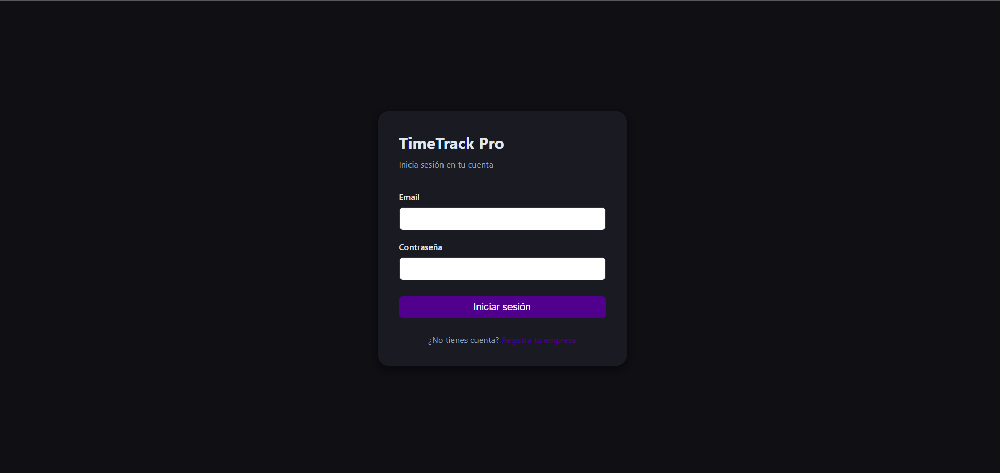
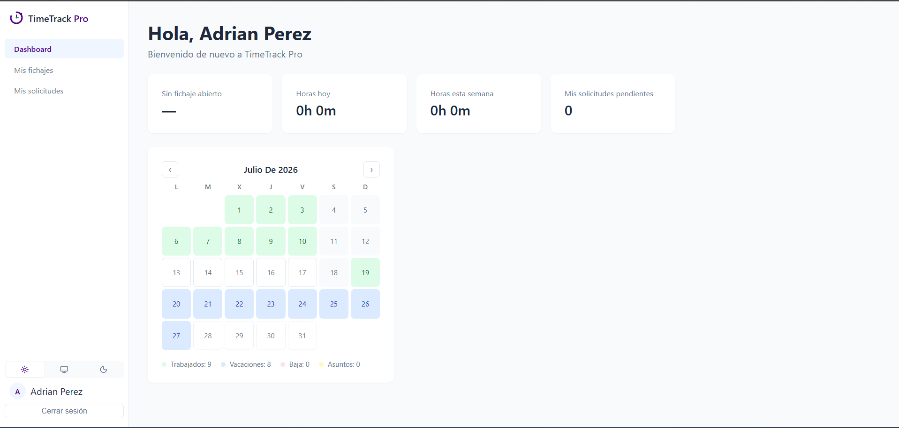
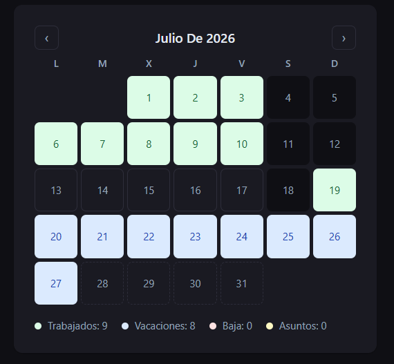
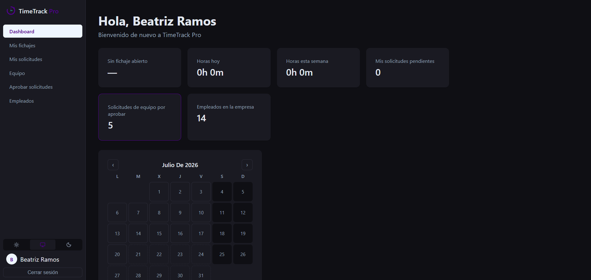
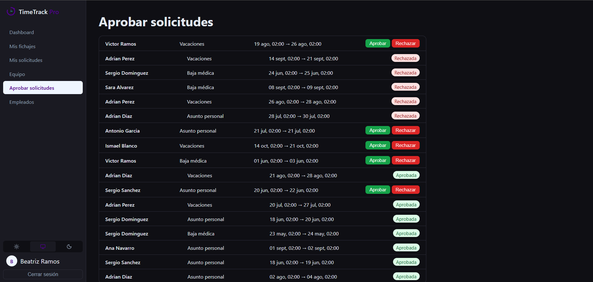
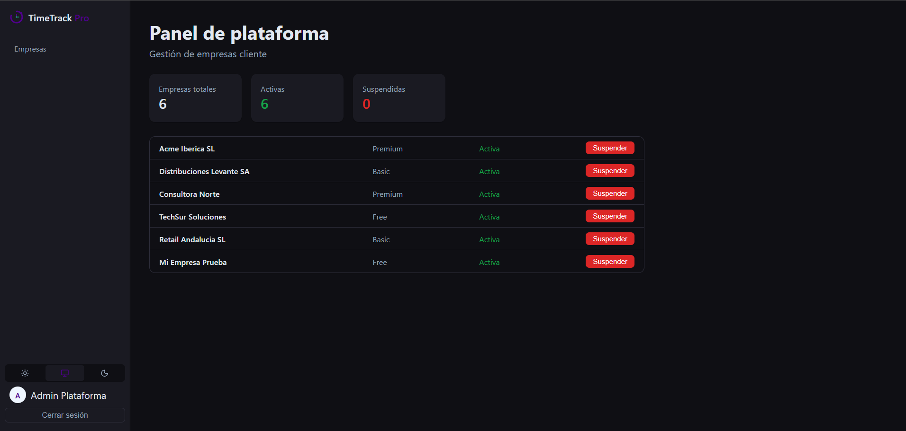

# TimeTrack Pro


**TimeTrack Pro** es una plataforma SaaS multi-tenant de control horario y gestión de ausencias, pensada para que una misma instalación dé servicio a múltiples empresas clientes de forma aislada y segura — desde pequeñas PYMEs hasta organizaciones con varios departamentos y niveles de aprobación.

🔗 **Demo en vivo:** [https://timetrackpro-seven.vercel.app](https://timetrackpro-seven.vercel.app)
🔗 **API:** [https://timetrackpro-api.onrender.com/api/v1/health](https://timetrackpro-api.onrender.com/api/v1/health)

> ⚠️ El backend está desplegado en el plan gratuito de Render, que "duerme" tras un rato de inactividad. La primera petición tras un periodo sin uso puede tardar 30-50 segundos en responder mientras el servicio despierta — es una limitación conocida del plan, no un fallo de la aplicación.

---

## 📖 Descripción

### El problema

La mayoría de PYMEs gestionan el control horario y las ausencias de su plantilla con hojas de cálculo, procesos manuales o herramientas genéricas no pensadas para su tamaño. Esto genera fricción real: falta de trazabilidad, aprobaciones lentas, y ningún resumen claro de horas trabajadas o días disponibles.

### La solución

Una aplicación web donde cada empresa cliente gestiona su propio equipo, con roles claros (empleado, manager, administrador) y flujos de aprobación reales — desplegada como un único servicio capaz de escalar a múltiples empresas sin fricción operativa.

### Público objetivo

Pequeñas y medianas empresas que necesitan una herramienta de control horario simple, profesional y accesible desde el primer día, sin necesidad de contratar un ERP completo.

---

## 🏗️ Arquitectura

El proyecto sigue una arquitectura **multi-tenant con base de datos compartida**: una única instalación sirve a todas las empresas clientes, aislando los datos de cada una mediante un `companyId` obligatorio en cada documento y un middleware que lo inyecta automáticamente en cada petición autenticada — nunca se confía en un valor que el cliente pueda manipular.
**Roles y jerarquía** (acumulativa — cada rol hereda los permisos del anterior):
- **Employee** — ficha su jornada, solicita ausencias, consulta su calendario laboral.
- **Manager** — todo lo anterior + aprueba/rechaza solicitudes de su equipo directo, ve sus fichajes.
- **CompanyAdmin** — todo lo anterior + gestiona empleados de su empresa (crear, editar, desactivar).
- **SuperAdmin** — gestiona las empresas cliente de la plataforma (activar/suspender acceso).

---

## 🛠️ Tecnologías

**Backend**
- Node.js + Express — API REST
- MongoDB + Mongoose — base de datos y modelado
- JWT — autenticación sin estado
- bcryptjs — hash de contraseñas
- express-validator — validación declarativa de entrada
- Transacciones de Mongoose — creación atómica de empresa + administrador

**Frontend**
- React 19 + Vite — SPA con lazy loading y code splitting por ruta
- React Router — enrutado y protección de rutas por rol
- Zustand — estado global (sesión, tema visual)
- Axios — cliente HTTP con interceptores (token automático, logout en 401)
- Vitest + React Testing Library — 22 tests automatizados

**Infraestructura**
- MongoDB Atlas — base de datos en la nube
- Render — despliegue del backend
- Vercel — despliegue del frontend

---

## 🚀 Instalación local

### Requisitos previos
- Node.js 18 o superior
- Una base de datos MongoDB (local o [Atlas](https://mongodb.com/cloud/atlas), gratis)

### Backend

```bash
cd backend
npm install
cp .env.example .env
# Edita .env con tu MONGODB_URI real y un JWT_SECRET propio
npm run seed   # puebla la base de datos con datos de ejemplo
npm start
```

El servidor arranca en `http://localhost:4000`.

### Frontend

```bash
cd frontend
npm install
cp .env.example .env
# Edita .env con la URL de tu backend si es distinta de la de desarrollo
npm run dev
```

La aplicación arranca en `http://localhost:5173`.

### Tests

```bash
cd frontend
npm test
```

---

## 🔐 Variables de entorno

**backend/.env**

| Variable | Descripción |
|---|---|
| `MONGODB_URI` | Cadena de conexión a MongoDB |
| `JWT_SECRET` | Secreto para firmar tokens (usa uno aleatorio y largo en producción) |
| `JWT_EXPIRES_IN` | Duración del token, ej. `8h` |
| `PORT` | Puerto del servidor (opcional, por defecto 4000) |
| `FRONTEND_URL` | URL del frontend desplegado, para restringir CORS en producción |

**frontend/.env**

| Variable | Descripción |
|---|---|
| `VITE_API_URL` | URL base de la API, ej. `http://localhost:4000/api/v1` |

---

## 📜 Scripts disponibles

| Comando | Ubicación | Descripción |
|---|---|---|
| `npm start` | `backend/` | Arranca el servidor |
| `npm run seed` | `backend/` | Puebla la base de datos con datos de ejemplo (1.000+ registros) |
| `npm run dev` | `frontend/` | Arranca el entorno de desarrollo |
| `npm test` | `frontend/` | Ejecuta la suite de tests |
| `npm run build` | `frontend/` | Genera el build de producción |

---

## 📸 Capturas de pantalla

<!--
  Coloca tus imágenes en docs/screenshots/ con estos nombres exactos
  y se mostrarán automáticamente aquí.
-->

| Login | Dashboard (Employee) |
|---|---|
|  |  |

| Calendario laboral | Modo oscuro |
|---|---|
|  |  |

| Gestión de equipo | Panel de plataforma (SuperAdmin) |
|---|---|
|  |  |

---

## 🔌 Endpoints principales de la API

Todas las rutas viven bajo `/api/v1`. Respuestas en formato uniforme `{ success, data }` o `{ success: false, error }`.

<details>
<summary><strong>Auth</strong></summary>

| Método | Ruta | Descripción |
|---|---|---|
| POST | `/auth/register-company` | Registra una empresa nueva + su administrador |
| POST | `/auth/login` | Inicia sesión |
| GET | `/auth/me` | Perfil del usuario autenticado |

</details>

<details>
<summary><strong>Users</strong></summary>

| Método | Ruta | Rol requerido |
|---|---|---|
| GET | `/users` | companyAdmin, manager |
| POST | `/users` | companyAdmin |
| PATCH | `/users/:id` | companyAdmin |
| DELETE | `/users/:id` | companyAdmin (desactivación) |

</details>

<details>
<summary><strong>TimeEntries</strong></summary>

| Método | Ruta | Descripción |
|---|---|---|
| POST | `/time-entries/clock-in` | Fichar entrada |
| POST | `/time-entries/clock-out` | Fichar salida |
| GET | `/time-entries` | Mis fichajes |
| GET | `/time-entries/team` | Fichajes del equipo (manager/companyAdmin) |
| PATCH | `/time-entries/:id` | Corrección manual (manager/companyAdmin) |

</details>

<details>
<summary><strong>LeaveRequests</strong></summary>

| Método | Ruta | Descripción |
|---|---|---|
| POST | `/leave-requests` | Crear solicitud |
| GET | `/leave-requests` | Mis solicitudes |
| GET | `/leave-requests/team` | Solicitudes del equipo |
| PATCH | `/leave-requests/:id/approve` | Aprobar |
| PATCH | `/leave-requests/:id/reject` | Rechazar |

</details>

<details>
<summary><strong>Companies (plataforma)</strong></summary>

| Método | Ruta | Rol requerido |
|---|---|---|
| GET | `/companies` | superAdmin |
| PATCH | `/companies/:id` | superAdmin (cambiar plan/estado) |

</details>

---

## 🗄️ Colecciones de la base de datos

| Colección | Descripción |
|---|---|
| `Company` | Empresa cliente (tenant raíz) — nombre, plan, estado, configuración |
| `User` | Usuarios de la plataforma — email, rol, empresa, manager asignado |
| `TimeEntry` | Fichajes — entrada, salida, duración calculada |
| `LeaveRequest` | Solicitudes de ausencia — tipo, fechas, estado, aprobador |

---

## 🧪 Testing

- **Backend:** verificación de integridad referencial de los datos semilla y pruebas manuales exhaustivas de cada endpoint (autenticación, aislamiento multi-tenant, roles, casos límite).
- **Frontend:** 22 tests automatizados con Vitest + React Testing Library, cubriendo autenticación, gestión de equipo, empleados y panel de plataforma.

---

## 🔮 Futuras mejoras

- **Personalización por empresa** — logo, colores y tipografía propios por tenant. El sistema de variables CSS del proyecto ya está preparado para esto: bastaría con sobrescribir las variables de tema según la empresa del usuario autenticado.
- **Notificaciones proactivas** — aviso de turnos asignados y cambios de horario.
- **Módulos adicionales** sobre la misma base multi-tenant: facturación (InvoiceFlow), inventario (StockSync).

---

## 👤 Autor

**Rubén Fernández**
GitHub: [@rubenferbu](https://github.com/rubenferbu)
LinkedIn: [rubenfernandezbuzon](https://linkedin.com/in/rubenfernandezbuzon)

---

## 📄 Licencia

Este proyecto está bajo la licencia MIT — ver el archivo [LICENSE](LICENSE) para más detalles.